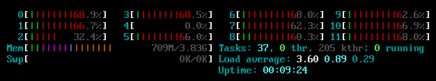
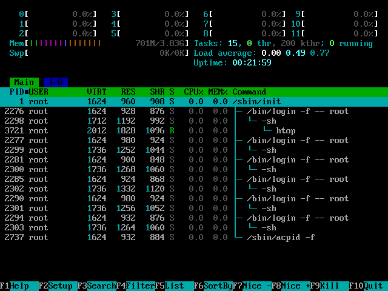

# bench-linux

<p align="center">
    💿 The minimal Linux Live CD ISO for micro-benchmarking 🧪
    <br>
    <strong><a href="#quick-start">⚡ Quick Start</a></strong>
    &emsp;
    <strong><a href="#usage">📖 Manual</a></strong>
    &emsp;
    <strong><a href="#contribution">🤝 Contribution</a></strong>
    &emsp;
    <strong><a href="#license">⚖️ MIT license</a></strong>
</p>

## What is it?

This is a bunch of scripts allowing anyone to build its own Alpine Linux distribution oriented on
clean and reproducible micro-benchmarking under Linux host.

Specifically, this is a Dockerfile that builds you a LiveCD Alpine Linux ISO with special
run configuration that isolates CPU 4 (by default, check [./mkimg.benchmark.sh](./mkimg.benchmark.sh))
from the Linux kernel and user-space tasks. Additionally, it stop the usage of "twin" CPU cores
that could steal resources between them.

### DEMO

<p align="center">
    
    <br>
    <em>CPU 4 is isolated from the scheduler</em>
</p>

## Why is it needed?

On the regular Linux host | On the `bench-linux` host
:-: | :-:
 | 

<p align="center">
    <em>Benchmark variance before and after <code>bench-linux</code></em>
</p>

On the real user-oriented Linux hosts, there are many sources of "noise" that may and will corrupt
any benchmarks:

- Background processes
- Hardware interrupts (IRQ)
- Simultaneous multithreading (SMT, "hyper-threading")
- etc.

These noises lead to observing a huge number of "outliers" during long-running benchmarks.
Using this, you may significantly reduce their number.

> [!NOTE]
> Using this distribution, however, don't save you from all sources of the noise.
> For example, from CPU throttling caused by overheating.

## Quick Start

Check the RELEASES tab on GitHub to **[⬇️ download a prebuilt ISO](../../releases)** for `x86_64` (`amd64`)
with the predefined configuration and follow the [Run](#run) section.

> [!IMPORTANT]
> If your computer has fewer than 5 CPU cores,
> read the [Configuration](#configuration) section first.

## Usage

### Configuration

Check your systems CPU configuration (for example, using `htop`):

- You need to determine the number of available CPU cores
- Also, pick the one CPU core which you are going to use for benchmarking
- If you have distinct "performance" and "powersave" CPU cores (for example, in a laptop),
  you need to run benchmarks on a "performance" core
- Also, your CPU cores most likely support SMT ("hyperthreading").
  In this case "twins" will not be able to run something and
  commonly numbers of disabled "twin"-cores are odd (CPU 1, CPU 3, etc.).

If you have at least 5 CPU cores, the default config is already good for you since it isolates CPU 4.
Otherwise, change the parameters in `kernel_cmdline` at [./mkimg.benchmark.sh](./mkimg.benchmark.sh).

### Build

You need [🐋 Docker](https://www.docker.com/get-started/).
Optionally, GNU make for convenience.

***

Type in your terminal being in the root of this repository:

```bash
make
```

This should automatically build the ISO and place it in the `output` directory.

***

If you don't have GNU make on your system, you may use the following:

```bash
docker build -t bench-linux . # add "--progress=plain" to debug
```

And after building the image, extract the ISO from it:

```bash
mkdir -p output
container=$(docker create bench-linux)
docker cp $container:/iso/. ./output
docker rm $container
```

### Run

You may try out the ISO using any hypervisor like VirtualBox.

> [!NOTE]
> Benchmarking in a managed environment is irrelevant.

***

Once you want to run the system on your host, use `dd` to burn your flash drive or something else:

```bash
sudo dd if=output/alpine-benchmark-3.21-x86_64.iso of=DRIVE bs=4K # replace DRIVE with the path
```

> [!CAUTION]
> Be very careful specifying the path to the drive.
> This command will fully destroy the existing contents of the path destination!

Reboot into the burned drive. It could take about few minutes with hanging screen but after all
you will get the Alpine Linux welcome text:

> ```
> Welcome to Alpine!
>
> The Alpine Wiki contains a large amount of how-to guides and general information
> about administrating Alpine systems.
> See <https://wiki.alpinelinux.org/>.
>
> You can setup the system with the command: `setup-alpine`
> ```

To perform a basic setup, use `setup-alpine` as suggested:

```bash
setup-alpine
```

On the question about SSH, type "none". It isn't necessary but you most likely will don't use it.

On the last question, type something like `/tmp/apkcache`. If you leave this question unchanged,
you will not be able to install packages in your LiveCD!

***

Use `apk` to update the package repository and install new packages. For example:

```bash
apk update
apk add bash git ssh opam # to benchmark OCaml-based application
```

Finally, you need to mount your main drive with the application code that you are going to benchmark.
For example, it could be a separated `/home`-partition on your hard drive:

```bash
mkdir /mnt/home
mount /dev/nvme0n1p4 /mnt/home # determine the path to your drive before
cd /mnt/home
ls # check that you have your files
```

Also, it is convenient to use `file` in order to remember which `/dev`-file corresponds to your drive:

```bash
apk add file
ls /dev # /dev/nvme* represent NVMe SSD drives
file -s /dev/nvme0n1p1 # DOS/MBR boot sector ... FAT (32 bit) ...
file -s /dev/nvme0n1p2 # Linux swap file ...
file -s /dev/nvme0n1p3 # Linux rev 1.0 ext4 filesystem data ... volume name "root" ...
file -s /dev/nvme0n1p4 # Linux rev 1.0 ext4 filesystem data ... volume name "home" ...
```

### Benchmarking

After installing dependencies and building your project,
you may also stop all unnecessary background tasks.
Determine them using `htop`.

By default, `setup-alpine` start some services to allow networking and automatically actualize
the system clock:

```bash
/etc/init.d/syslog stop
/etc/init.d/networking stop
```

After stopping non‑essential services, your process tree should look like this:

<p align="center">
    
    <br>
    <em><code>htop</code> in the tree mode (F5)</em>
</p>

Also, ensure the usage of the "performance" power governor for the picked CPU core, if applicable:

```bash
cat /sys/devices/system/cpu/cpu4/cpufreq/scaling_governor
# performance
```

***

Once you've stopped all unnecessary task, run your benchmarks on the picked CPU core (by default, 4).
It could be done using `taskset` or by configuration inside the benchmark itself:

```bash
taskset -c 4 sleep 10 # run "sleep 10" on the CPU 4
```

Additionally, to be sure, you may set NICE -20 for you benchmark
or run it in real-time scheduling mode:

```bash
renice -20 -p $$ # set NICE -20 for the current shell

ulimit -r unlimited # ensure the ability to use real-time scheduling

chrt -f 99 sleep 10 # run "sleep 10" with SCHED_FIFO (interruptible) scheduling mode and the greatest priority
```

✨ Good luck and have a nice benchmarking experience!

## Contribution

Contributions are always welcome if you have something to improve in this minimal configuration!

While the initial configuration was derived using AI, it was completely rewritten manually and
fully AI-produced contributions are undesirable to preserve the simplicity and understandability.

## License

This project is licensed under the MIT License - see the [LICENSE](./LICENSE) file for details.
